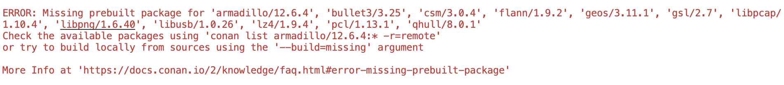

# Building Terminus Repos

## Build Order

1. `terminus-cmake`
2. `terminus-log`
3. `terminus-outcome`
4. `terminus-core`
5. `terminus-math`
6. `terminus-isis`
7. `terminus-image`
8. `terminus-warpcore-demos`

### Important notes on building each repo

These repos are designed to work on every platform.  Care is taken to ensure there is never a "breaking" update which is processor, system, node, or "whatever metric you define"-specific. 

Always, always, always, after every build, test via the following... (Except `terminus-cmake`)

    cd build
    ctest

### Other notes

When building **for the first time**, it's important to remember that you may not have the conan packages which are required to build these libraries installed.  In general, build first using the normal `build-conan.sh` command, then observe if there is a dependency failure.

This is a good example of what you'll find:

Thus, on the first time only, do the following...

    $> conan-build.sh -c --build-missing

Once you build the first time, the build error for missing dependencies will go away.  This is particularly important in `terminus-log` and `terminus-isis`, where a huge number of libraries are missing. 

